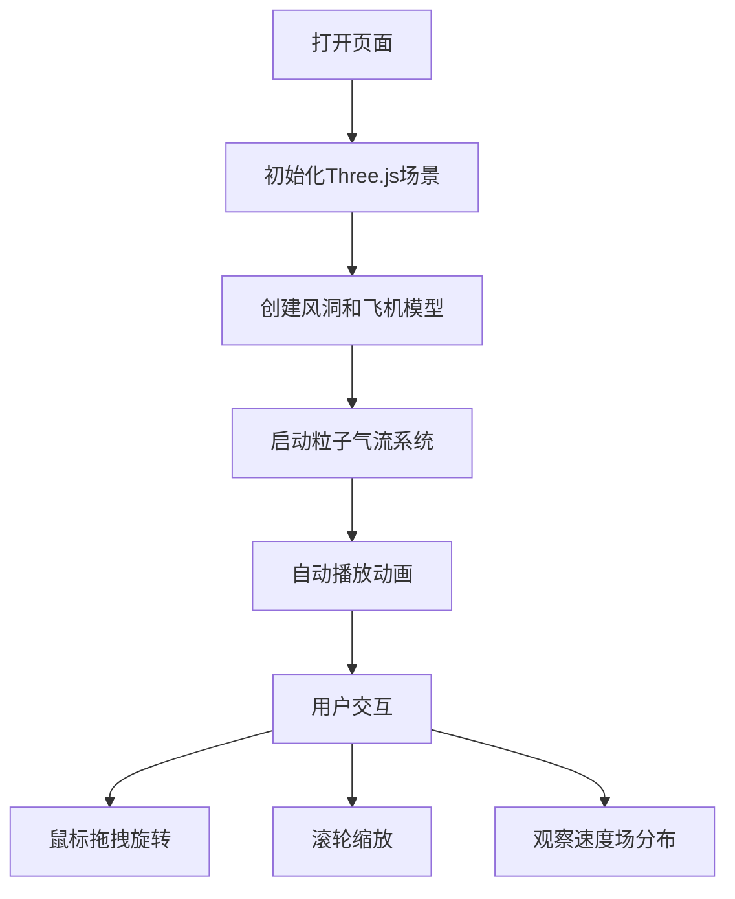

## 1. 产品概述

3D飞机风洞模拟场景，通过Three.js实现交互式的空气动力学可视化演示。主要用于航空航天教学、科普展示或工程分析的辅助工具，帮助用户直观理解气流流经飞机表面时的速度场分布特性。

## 2. 核心功能

### 2.1 用户角色

| 角色 | 注册方式 | 核心权限 |
|------|----------|----------|
| 普通用户 | 无需注册 | 浏览3D场景、交互控制视角、观察气流模拟效果 |

### 2.2 功能模块

1. **风洞场景**：透明矩形风洞容器、内部飞机模型、环境光照系统
2. **气流可视化**：彩色粒子流线系统、速度场分布表现（机翼上方流速更快）、流动条纹动画
3. **交互控制**：鼠标拖拽旋转视角、滚轮缩放、自动旋转演示

### 2.3 页面详情

| 页面名称 | 模块名称 | 功能描述 |
|---------|----------|----------|
| 主页面 | 3D风洞场景 | 展示透明风洞和飞机模型，粒子气流沿轴线流动 |
| 主页面 | 交互控制层 | 鼠标旋转、滚轮缩放、自动旋转切换 |
| 主页面 | 信息面板 | 显示当前气流速度、粒子数量等参数 |

## 3. 核心流程

用户打开页面后，3D场景自动加载并开始动画演示。用户可以通过鼠标拖拽旋转视角观察飞机的不同角度，通过滚轮缩放查看细节，观察彩色粒子在风洞中的流动轨迹，特别是机翼上下方的流速差异。

## 4. 用户界面设计

### 4.1 设计风格

- **主色调**：深蓝色（#0a1628）作为背景，科技感十足
- **辅助色**：青色（#00d4ff）用于高速气流，橙色（#ff6b35）用于低速区域，紫色（#9d4edd）用于过渡区域
- **风格**：未来科技感、极简主义、数据可视化风格
- **字体**：使用现代无衬线字体，数字使用等宽字体
- **布局**：全屏3D场景，角落信息面板半透明悬浮

### 4.2 页面设计概述

| 页面名称 | 模块名称 | UI元素 |
|---------|----------|--------|
| 主页面 | 3D场景 | 深色背景、透明玻璃风洞、金属质感飞机、彩色粒子流 |
| 主页面 | 控制面板 | 半透明圆角卡片、状态指示灯、切换按钮 |
| 主页面 | 速度图例 | 渐变色条、速度值标注 |

### 4.3 响应性

- 桌面端优先，自适应浏览器窗口大小
- 支持鼠标和触摸操作
- 信息面板在小屏幕上自动调整位置

### 4.4 3D场景指导

- **环境**：深色太空风格背景，微弱的环境光和方向光组合，营造实验室氛围
- **灯光设置**：环境光（0x404040）+ 主方向光（0xffffff，强度1.0）+ 补光（0x00d4ff，强度0.3），飞机使用金属材质配合高光
- **相机设置**：透视相机，初始位置在风洞侧前方45度角，看向场景中心
- **构图**：风洞居中，飞机位于风洞中心偏后位置，粒子从后方流入前方流出
- **交互和动画**：OrbitControls控制旋转缩放，粒子沿风洞Z轴流动，机翼上方粒子速度提升1.5-2倍
- **后处理效果**：轻微的Bloom发光效果，使粒子流线更加醒目
- **性能**：控制粒子数量在2000-5000之间，使用BufferGeometry优化性能
