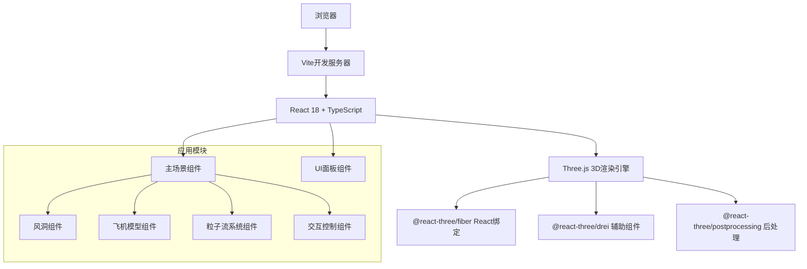

## 1. 架构设计



## 2. 技术描述

- **前端框架**：React 18 + TypeScript
- **构建工具**：Vite 5
- **3D引擎**：Three.js ^0.160.0
- **React-Three绑定**：@react-three/fiber ^8.15.0
- **3D辅助组件**：@react-three/drei ^9.92.0
- **后处理效果**：@react-three/postprocessing ^2.15.0
- **样式方案**：TailwindCSS 3
- **状态管理**：Zustand

## 3. 项目结构

```
aircraftWindTunnel/
├── src/
│   ├── components/
│   │   ├── WindTunnelScene.tsx      # 主3D场景
│   │   ├── WindTunnel.tsx           # 风洞模型
│   │   ├── Aircraft.tsx             # 飞机模型
│   │   ├── ParticleFlow.tsx         # 粒子气流系统
│   │   ├── ControlPanel.tsx         # 控制面板UI
│   │   └── SpeedLegend.tsx          # 速度图例
│   ├── hooks/
│   │   └── useParticleSystem.ts     # 粒子系统自定义Hook
│   ├── store/
│   │   └── useSceneStore.ts         # 场景状态管理
│   ├── utils/
│   │   ├── velocityField.ts         # 速度场计算函数
│   │   └── colors.ts                # 颜色配置
│   ├── App.tsx
│   ├── main.tsx
│   └── index.css
├── package.json
├── vite.config.ts
├── tsconfig.json
└── tailwind.config.js
```

## 4. 核心模块说明

### 4.1 主场景模块 (WindTunnelScene.tsx)
- 初始化Three.js场景、相机、渲染器
- 设置灯光和环境
- 集成所有3D子组件
- 处理窗口大小变化

### 4.2 风洞模块 (WindTunnel.tsx)
- 创建透明矩形风洞壳体
- 使用半透明玻璃材质
- 添加风洞边框和刻度标记

### 4.3 飞机模型模块 (Aircraft.tsx)
- 使用Three.js基础几何体构建飞机模型
- 机身、机翼、尾翼、驾驶舱等部件
- 金属质感材质

### 4.4 粒子流系统模块 (ParticleFlow.tsx)
- 使用BufferGeometry管理大量粒子
- 实现速度场采样函数
- 机翼上方区域速度提升
- 粒子颜色映射到速度值
- 循环流动动画

### 4.5 交互控制模块
- 使用@react-three/drei的OrbitControls
- 支持旋转、缩放、平移
- 可切换自动旋转

### 4.6 状态管理 (useSceneStore.ts)
- 气流速度参数
- 粒子数量
- 自动旋转开关
- 显示控制（风洞/飞机/粒子）
